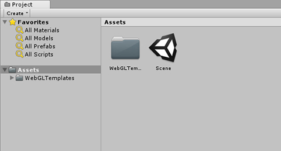
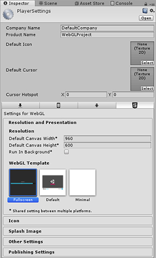

# Unity-WebGL-Fullscreen-Template
A custom fullscreen WebGL template which can be used inside unity to create builds.

<h3>How to use</h3>

Keep the 'WebGLTemplates' folder in your Unity project's asset folder as shown above.

Unity will now recognize the new WebGL build template and display under WebGL Player Settings. Select and build using the new template.You can customize the template colors and styles by modifying the the index.html file.

